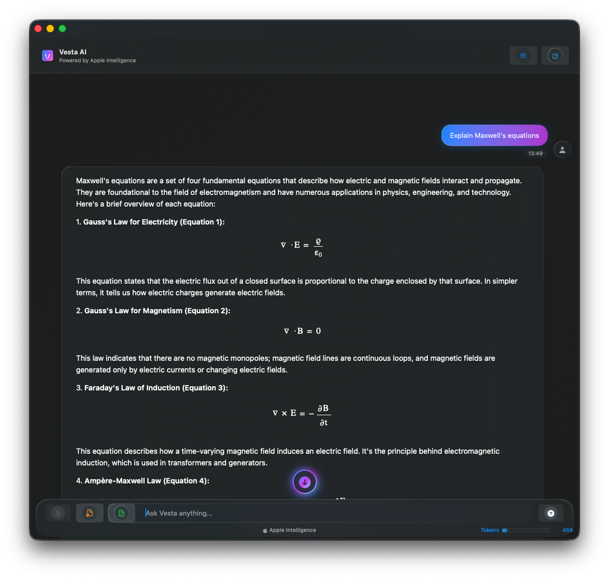

# Vesta AI for macOS Distribution repo - MacOS Tahoe 26 release (NOW WITH QWEN3-VL)

## Dec 10, 2025 --> Latest app release --> https://github.com/scouzi1966/vesta-mac-dist/releases/tag/v0.9.0

## For the "Just take me to the download" people --> https://github.com/scouzi1966/vesta-mac-dist/releases/download/v0.9.0/Vesta-0.9.0.dmg

I am not trying to build a better LMStudio or Jan. This is more of a curated App to run models locally without requiring the technical knowledge or having to filter out the sea of models on HuggingFace. I selected Qwen3-VL as the vision model for now because of its benchmarks and footprint for consumer grade hardware. It also handles regular text-to-text quite well as well.

Note that there is a known bug in Qwen3-VL models where it will loop indefinately in some cases and never complete. In this case stop the generation and tweak your prompt. This is a model behavior, not the App.
reference: https://github.com/QwenLM/Qwen3-VL/issues/1611#issuecomment-3639175711

## Read-up on Qwen3-VL and its capabilities:
https://qwen.ai/blog?id=99f0335c4ad9ff6153e517418d48535ab6d8afef&from=research.latest-advancements-list

## Vesta 0.9.0 

# Multi-Model version with Side by side Apple Foundation on-device model and Qwen3-VL which user needs to download once
 
  ### 🆕 New in 0.9.0
  - **Vision capabilities** with Qwen3-VL model (describe images, analyze screenshots)
  - **Continuity Camera** input (capture photos directly from iPhone/iPad)
  - **Code syntax highlighting** for 20+ programming languages
  - **Edit responses** inline after generation
  - **HTML preview** for rendered content
  - **Enhanced LaTeX** math rendering in blockquotes
  - Improved rendering engine with real-time code block highlighting

  ### 🚀 Features
  - Apple Intelligence integration for on-device AI
  - Vision mode for image understanding (llama.cpp + Qwen3-VL)
  - Voice input with speech-to-text
  - GitHub Flavored Markdown rendering
  - LaTeX math rendering (KaTeX)
  - Liquid Glass UI design
  - App sandbox security
  - Developer ID signed and Apple notarized

  ### 📋 Installation
  1. Download the DMG file below
  2. Open the DMG and drag Vesta to Applications
  3. Launch Vesta from Applications folder
  4. On first run, right-click and select "Open" if prompted

  ### 🔒 Privacy
  - **Untethered from the internet** (except one-time Vision model download)
  - All AI processing happens on-device
  - No data sent to external servers

  ### 📱 Requirements
  - macOS 26.0 (Tahoe) or later
  - Mac with Apple Silicon
  - Microphone access (for voice input features)

Official distribution repository for Vesta - AI-powered chat assistant with Apple Intelligence integration.

For cli lovers, I've created something similar here: https://github.com/scouzi1966/maclocal-api

## 📥 Download

**[⬇️ Download Latest Release](https://github.com/scouzi1966/vesta-mac-dist/releases/latest)**

All releases are code-signed with Developer ID and notarized by Apple for security.

## 🚀 Features

- **Apple Intelligence Integration** - On-device AI processing with Apple's Foundation Models framework
- **System Prompt Control** - The system prompt (Instructions in Apple's jargon) can be modified
- **Context use indicator** - Approximate context window usage
- ** (NOW DEPRECATED) Load LoRA adapters** - Allows loading custom adapaters trained with Apple's toolkit (https://developer.apple.com/apple-intelligence/foundation-models-adapter/). An example adapter can be found here: https://github.com/scouzi1966/vesta-mac-dist/tree/main/adapters
- **Voice Input** - Speech-to-text functionality for natural interaction
- **LaTeX Math Rendering** - Support for mathematical equations and formulas
- **Liquid Glass UI** - Beautiful macOS-native interface design
- **Complete Privacy** - All processing happens on-device, no data sent to servers
- **App Sandbox Security** - Enhanced system protection and security compliance

## 📋 Installation

1. **Download** the latest DMG file from the releases page
2. **Open** the DMG file
3. **Drag** Vesta.app to your Applications folder
4. **Launch** Vesta from Applications
5. **First Run**: If you see a security warning, right-click Vesta and select "Open"

## 📱 System Requirements

- **macOS 26.0 Beta** or later
- **Apple Silicon Mac** (M1 or later recommended)
- **Xcode 26.0 Beta** for development builds
- **Microphone access** for voice input features

## 🔒 Security & Privacy

### Code Signing
- Signed with **Developer ID Application: Soprano Technologies Inc.**
- **Notarized by Apple** for additional security verification
- **App Sandbox enabled** for enhanced system protection

### Privacy
- **100% On-Device Processing** - All AI computations happen locally
- **No Data Collection** - No analytics, telemetry, or user data sent to servers
- **Microphone Privacy** - Voice input may be sent to Apple with Apple security for speach to Text
- **Transparent Permissions** - Clear explanations for all requested permissions

## 📖 Usage

### For End Users
Simply download the DMG from the releases page and install normally.

### For Developers
This is a distribution-only repository. Build automation is handled from the main development repository.

## 🔗 Related Repositories

- **Source Code**: Private development repository (contains all source code and build scripts)
- **Distribution**: This repository (public downloads only)

## 📊 Release History

See [Releases](https://github.com/scouzi1966/vesta-mac-dist/releases) for complete version history and changelog.

## 💬 Support

For support, feature requests, or bug reports:

1. **[🐛 Report an Issue](https://github.com/scouzi1966/vesta-mac-dist/issues/new)** - Report bugs, crashes, or unexpected behavior
2. **[💡 Request a Feature](https://github.com/scouzi1966/vesta-mac-dist/issues/new)** - Suggest new features or improvements  
3. **[❓ Ask Questions](https://github.com/scouzi1966/vesta-mac-dist/issues)** - Get help with installation or usage

Before creating a new issue:
- Check existing [issues](https://github.com/scouzi1966/vesta-mac-dist/issues) for similar problems
- Verify you're running the [latest version](https://github.com/scouzi1966/vesta-mac-dist/releases/latest)
- Ensure your system meets the requirements above

## 📄 License

© 2025 Soprano Technologies Inc. All rights reserved.

## 🏗 Built With

- **Apple Intelligence** - Foundation Models framework
- **SwiftUI** - Native macOS interface
- **Speech Recognition** - Apple Speech framework  
- **LaTeX Rendering** - MathJax integration
- **Automated Pipeline** - GitHub Actions + Custom Scripts

---

🤖 **Built with automated distribution pipeline**  
🔒 **Notarized and code-signed for security**  
🚀 **Ready for production deployment**

## ⭐ Star History

