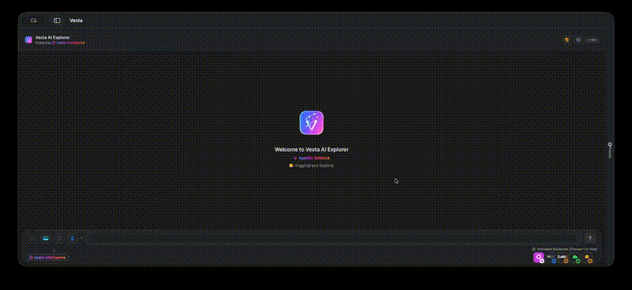

If you find this useful, please star the repo! &nbsp; Also check out [afm CLI](https://github.com/scouzi1966/maclocal-api) — OpenAI-compatible local API server for Mac.

# Vesta AI Explorer for macOS

Multi-backend AI chat application for macOS that runs models locally on Apple Silicon. Five AI backends simultaneously — Apple Intelligence, MLX, llama.cpp, HuggingFace Inference API, and OpenAI-compatible API servers — with runtime switching, vision understanding, text-to-speech, speech-to-text, image generation, video generation, and a full MCP server for programmatic control.

### Website &nbsp; https://kruks.ai/

### Demo

[](https://vesta-mac.pages.dev/mcp-demo.mp4)

*Click to watch the full demo video*

## Install
|  | Stable (v0.9.5) | Nightly (vesta-mac-next) |
|---|---|---|
| **Homebrew** | `brew install --cask scouzi1966/afm/vesta-mac` | `brew install --cask scouzi1966/afm/vesta-mac-next` |
| **DMG** | [Download Vesta-0.9.5.dmg](https://github.com/scouzi1966/vesta-mac-dist/releases/download/v0.9.5/Vesta-0.9.5.dmg) | [Download Vesta-next.dmg](https://github.com/scouzi1966/vesta-mac-dist/releases/download/nightly-20260302-d050a1e/Vesta-next.dmg) |
| **Release notes** | [v0.9.5](https://github.com/scouzi1966/vesta-mac-dist/releases/tag/v0.9.5) | [Latest nightly](https://github.com/scouzi1966/vesta-mac-dist/releases/tag/nightly-20260302-d050a1e) |

> [!TIP]
> **Switching between stable and nightly:**
> ```bash
> brew uninstall --cask vesta-mac && brew install --cask scouzi1966/afm/vesta-mac-next   # switch to nightly
> brew uninstall --cask vesta-mac-next && brew install --cask scouzi1966/afm/vesta-mac   # switch back to stable
> ```

## What's new in Vesta-next

> [!IMPORTANT]
> The nightly build is the future stable release. It includes everything in the current stable plus:
> - **Qwen3.5 dual-mode loading** — load as VLM (vision) or LLM-only (faster text inference)
> - **Qwen3.5-35B-A3B MoE** — run a 35B model with only 3B active parameters
> - **Full tool calling** — Qwen3-Coder, Gemma, GLM, Kimi-K2.5, and more
> - **Prompt prefix caching** for faster repeat inference
> - **Stop sequences** with `<think>` model support
> - **New architectures** — Qwen3.5, Gemma 3n, Kimi-K2.5, MiniMax M2.5, Nemotron
> - top-k, min-p and presence penalty parameters
> - logprobs for agentic interpretability testing
> - Many more improvements from [maclocal-api](https://github.com/scouzi1966/maclocal-api) upstream

---

## Features

- **Apple Intelligence** — on-device AI via Foundation Models framework (always available)
- **MLX Backend** — Apple Silicon optimized inference with mlx-swift (Qwen3-VL, Qwen3.5 vision models)
- **llama.cpp Backend** — GGUF model support with full Metal GPU acceleration and Jinja templates
- **HuggingFace Explorer** — cloud inference, image/video generation, transcription via 16+ providers
- **External AI** — connect to any OpenAI-compatible API server (LM Studio, Ollama, etc.)
- **Vision** — image understanding via Qwen3-VL / Qwen3.5 (MLX, llama.cpp, or HuggingFace)
- **Text-to-Speech** — Kokoro, Marvis (with voice cloning), and Orpheus TTS engines
- **Speech-to-Text** — WhisperKit on-device transcription (Tiny through Large V3)
- **MCP Server** — 41+ tools for programmatic control, model management, and AI Sidekick integration
- **GitHub Flavored Markdown** — tables, task lists, strikethrough via remark/rehype pipeline
- **LaTeX Math** — inline and block math rendering with KaTeX
- **Code Highlighting** — 20+ languages with real-time streaming highlight
- **Liquid Glass UI** — native macOS Tahoe design
- **App Sandbox** — Developer ID signed and Apple notarized

## Requirements

- **macOS 26.0** (Tahoe) or later
- **Apple Silicon Mac** (M1/M2/M3/M4)
- Microphone access for voice input and STT
- Internet access for HuggingFace backend and model downloads (on-device backends work offline after model download)

## Security & Privacy

- Signed with **Developer ID Application: Soprano Technologies Inc.**
- **Notarized by Apple**
- **App Sandbox enabled**
- On-device backends (Apple Intelligence, MLX, llama.cpp) process everything locally — no data sent to servers
- API tokens stored in macOS Keychain

## Related

- **Source Code**: https://github.com/scouzi1966/vesta-mac
- **Distribution**: https://github.com/scouzi1966/vesta-mac-dist (this repo)
- **CLI Alternative**: https://github.com/scouzi1966/maclocal-api

---

[](https://developer.apple.com/macos/)
[](https://support.apple.com/en-us/116943)

Built with automated nightly pipeline | Notarized and code-signed | Apple Silicon native

## Star History

[](https://star-history.com/#scouzi1966/vesta-mac-dist&Date)
