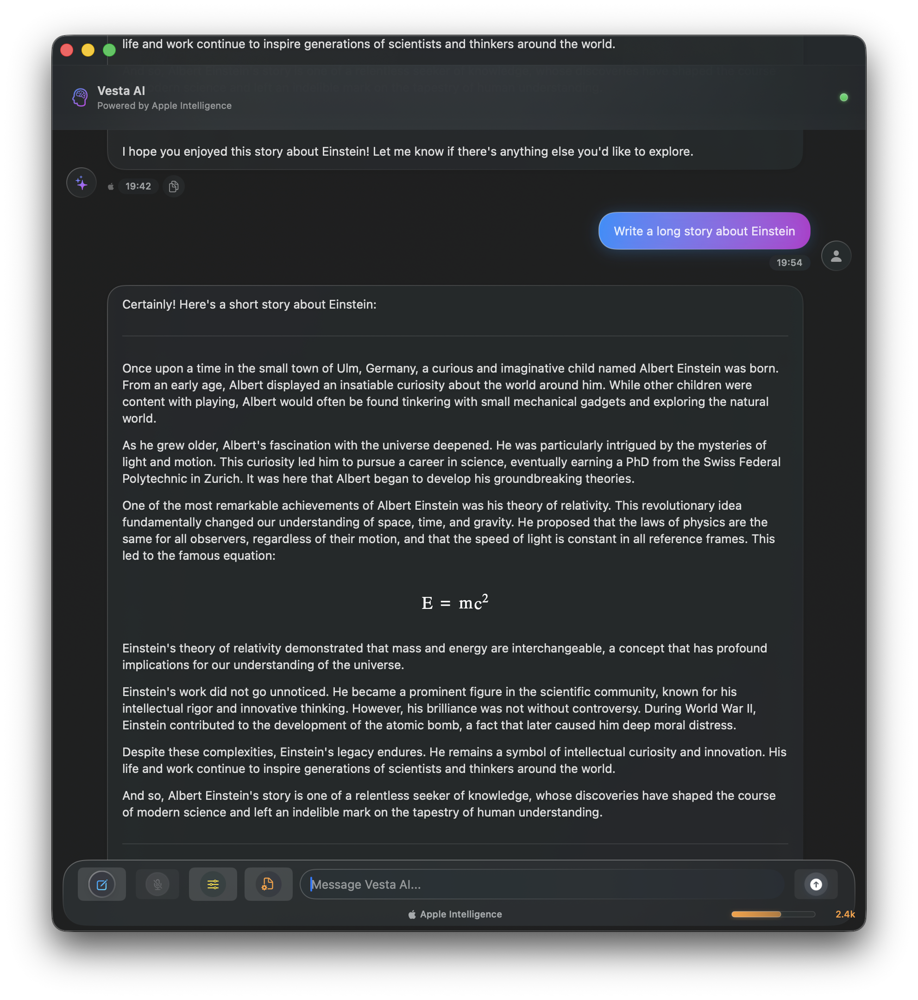

# Vesta macOS Distribution

Official distribution repository for Vesta - AI-powered chat assistant with Apple Intelligence integration.

## 📥 Download

**[⬇️ Download Latest Release](https://github.com/scouzi1966/vesta-mac-dist/releases/latest)**

All releases are code-signed with Developer ID and notarized by Apple for security.

## 🚀 Features

- **Apple Intelligence Integration** - On-device AI processing with Apple's Foundation Models framework
- **Voice Input** - Speech-to-text functionality for natural interaction
- **LaTeX Math Rendering** - Support for mathematical equations and formulas
- **Liquid Glass UI** - Beautiful macOS-native interface design
- **Complete Privacy** - All processing happens on-device, no data sent to servers
- **App Sandbox Security** - Enhanced system protection and security compliance

## 📋 Installation

1. **Download** the latest DMG file from the releases page
2. **Open** the DMG file
3. **Drag** Vesta.app to your Applications folder
4. **Launch** Vesta from Applications
5. **First Run**: If you see a security warning, right-click Vesta and select "Open"

## 📱 System Requirements

- **macOS 26.0 Beta** or later
- **Apple Silicon Mac** (M1 or later recommended)
- **Xcode 26.0 Beta** for development builds
- **Microphone access** for voice input features

## 🔒 Security & Privacy

### Code Signing
- Signed with **Developer ID Application: Soprano Technologies Inc.**
- **Notarized by Apple** for additional security verification
- **App Sandbox enabled** for enhanced system protection

### Privacy
- **100% On-Device Processing** - All AI computations happen locally
- **No Data Collection** - No analytics, telemetry, or user data sent to servers
- **Microphone Privacy** - Voice input processed locally, never transmitted
- **Transparent Permissions** - Clear explanations for all requested permissions

## 📖 Usage

### For End Users
Simply download the DMG from the releases page and install normally.

### For Developers
This is a distribution-only repository. Build automation is handled from the main development repository.

## 🔗 Related Repositories

- **Source Code**: Private development repository (contains all source code and build scripts)
- **Distribution**: This repository (public downloads only)

## 📊 Release History

See [Releases](https://github.com/scouzi1966/vesta-mac-dist/releases) for complete version history and changelog.

## 💬 Support

For support, feature requests, or bug reports:

1. **[🐛 Report an Issue](https://github.com/scouzi1966/vesta-mac-dist/issues/new)** - Report bugs, crashes, or unexpected behavior
2. **[💡 Request a Feature](https://github.com/scouzi1966/vesta-mac-dist/issues/new)** - Suggest new features or improvements  
3. **[❓ Ask Questions](https://github.com/scouzi1966/vesta-mac-dist/issues)** - Get help with installation or usage

Before creating a new issue:
- Check existing [issues](https://github.com/scouzi1966/vesta-mac-dist/issues) for similar problems
- Verify you're running the [latest version](https://github.com/scouzi1966/vesta-mac-dist/releases/latest)
- Ensure your system meets the requirements above

## 📄 License

© 2025 Soprano Technologies Inc. All rights reserved.

## 🏗 Built With

- **Apple Intelligence** - Foundation Models framework
- **SwiftUI** - Native macOS interface
- **Speech Recognition** - Apple Speech framework  
- **LaTeX Rendering** - MathJax integration
- **Automated Pipeline** - GitHub Actions + Custom Scripts

---

🤖 **Built with automated distribution pipeline**  
🔒 **Notarized and code-signed for security**  
🚀 **Ready for production deployment**
